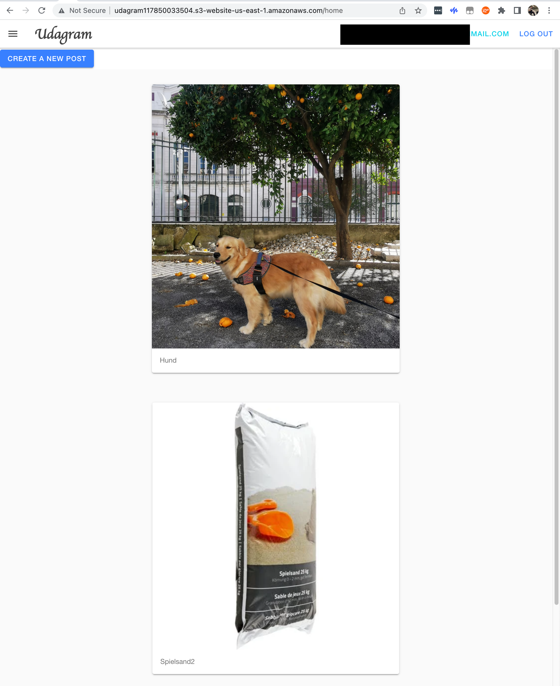

# Udagram a Full-Stack Application

## Overview

Udagram is a simple, Instagram-like application where users can register and log in to share images, view images shared by other users, and interact with them. The application is a full-stack application with a front-end built in Angular and a back-end developed using Node.js and Express.

This project focuses on deploying this full-stack application to a cloud service provider (AWS), making it accessible to users. It will guide you through the process of setting up and configuring the necessary AWS services, such as a Postgres RDS database and an S3 bucket for storing images and Frontend. The project also integrates a CI/CD pipeline using CircleCI, which automates the deployment process whenever new code is pushed to the main GitHub branch.

## Application Preview



You can see the live application at [Udagram Live](http://udagram117850033504.s3-website-us-east-1.amazonaws.com/home)


## Installation and Setup

Follow the steps below to set up the application locally:

1. Make sure you have the following dependencies installed on your system:
    - Node v16.20.1 (LTS) or more recent.
    - npm 8.19.4 (LTS) or more recent.
    - AWS CLI v2.
    - Elastic Beanstalk CLI (EB CLI) v3.
    
2. Provision the necessary AWS services:
    - Create a publicly accessible RDS database running Postgres.
    - Create an S3 bucket for hosting the uploaded files.
    
3. Export the following environment variables needed:
    - `POSTGRES_USERNAME`: This is the username for your PostgreSQL database instance. You will set this when creating your RDS instance.
    - `POSTGRES_PASSWORD`: This is the password for your PostgreSQL database instance. This is also set when creating your RDS instance.
    - `POSTGRES_HOST`: This is the endpoint URL of your PostgreSQL database instance. You will receive this after setting up your RDS instance.
    - `POSTGRES_DB`: This is the name of the PostgreSQL database that you will be using for the application.
    - `AWS_BUCKET`: This is the name of the AWS S3 bucket where the images are to be stored. This bucket needs to be created and configured in AWS S3.
    - `AWS_REGION`: This is the region where your AWS services are hosted. It should be set based on where you've set up your RDS and S3 instances.
    - `JWT_SECRET`: This is the secret key used to sign and verify JSON Web Tokens for user authentication. You can choose a strong, random string as the secret key.
    - `AWS_PROFILE`:  This is the named profile in your AWS credentials file that the Elastic Beanstalk CLI will use to make calls to AWS services. You create a named profile using the `aws configure --profile profilename` command, and it associates set access keys with a specific name.

4.  Navigate to the `udagram-api` folder from the root of the repo (`cd udagram/udagram-api`), install the dependencies with `npm install`, and start the API in development mode with `npm run dev`.

5. Without closing the previous terminal, navigate to the `udagram-frontend` folder (`cd udagram/udagram-frontend`), install the dependencies with `npm install -f`, and start the front-end in development mode with `npm run start`.

## Testing

This project contains two different types of tests for the frontend: unit tests and end-to-end tests (e2e).

### Unit Tests:

The frontend unit tests are developed using the Karma test runner and Mocha testing framework, in combination with Jasmine for assertions. To run these tests, follow these steps:

Navigate to the udagram-frontend folder and run:
```
cd udagram/udagram-frontend
npm run test
```

Please note that the backend currently does not include any unit tests.

### End to End Tests:

End-to-end tests are designed to test the system as a whole, rather than individual parts. These are developed using Protractor, which is an end-to-end test framework for Angular applications, and Jasmine for assertions. To run these tests, follow these steps:
```
cd udagram/udagram-frontend
npm run e2e
```

Both unit tests and end-to-end tests are part of the CI/CD pipeline and are automatically executed during the pipeline process.

## Built With

- [Angular](https://angular.io/) - Single Page Application Framework
- [Ionic](https://ionicframework.com/): Open-source Framework for building cross-platform mobile applications using web technologies like JavaScript, HTML, and CSS.
- [Node](https://nodejs.org) - Javascript Runtime
- [Express](https://expressjs.com/) - Javascript API Framework
- [Karma](https://karma-runner.github.io/latest/index.html): Test Runner for JavaScript
- [Mocha](https://mochajs.org/): JavaScript Test Framework for Node.js
- [Jasmine](https://jasmine.github.io/): Behavior-Driven Development Framework for testing JavaScript code
- [Protractor](http://www.protractortest.org/): End-to-End Test Framework for Angular Applications


## License

[License](LICENSE.txt)
