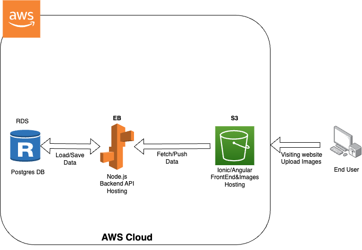

# Udagram Infrastructure
Udagram uses several AWS services to build a complete production-ready web application. Here's the breakdown of the infrastructure:

### 1. **Amazon RDS**
A single instance of PostgreSQL database is created on Amazon RDS (Relational Database Service). It is used to store all the application data including user profiles and image metadata. The database is configured to be publicly accessible for easier connections with the application server.

### 2. **Amazon S3**
Amazon S3 (Simple Storage Service) is used in two parts of the application:

* **Frontend Hosting**: The frontend application, built using Angular and Ionic, is stored and hosted in a publicly accessible S3 bucket. This allows the users to access the website directly using the S3 hosting link.

* **Image Storage**: Whenever a user uploads an image via the frontend, the image is stored in the same S3 bucket. The images are served directly from S3 to the users, improving performance and offloading traffic from the application server.

### 3. **AWS Elastic Beanstalk**
Elastic Beanstalk is used to host and manage the backend API for the Udagram application. The backend is developed using Node.js and Express. Elastic Beanstalk automates the process of deployment, from capacity provisioning, load balancing, auto-scaling to application health monitoring, providing a fully managed platform for the application.

The application server hosted on Elastic Beanstalk connects to the RDS PostgreSQL database to fetch or store data as per user interactions on the frontend. It also serves signed URLs for uploading images to the S3 bucket.