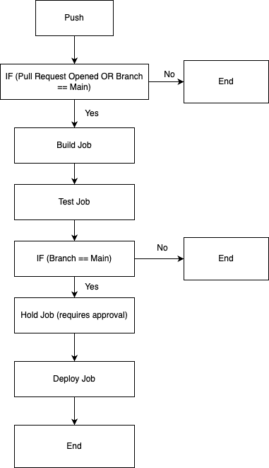

# Udagram CI/CD Pipeline Overview

The CI/CD (Continuous Integration/Continuous Delivery) pipeline for the Udagram project is implemented using CircleCI. This document provides an overview of the various steps in the pipeline based on the provided configuration.

The pipeline is comprised of three key jobs: `build`, `test`, and `deploy`, which are defined and managed using various CircleCI orbs and docker images.

### 1. **Build Job**:
   The build job uses the `circleci/node` docker image, which provides a Node.js environment for building the application. This job carries out several steps including:

   - Setting up Node.js with the required version using the `node/install` command.
   - Checking out the code from the repository.
   - Installing dependencies for both the frontend and backend using npm.
   - Building the frontend and backend applications.
   - Persisting the workspace for use in subsequent jobs.

### 2. **Test Job**:
   The test job uses the `circleci/node-browsers` docker image, which provides a Node.js environment with a pre-installed browser for running end-to-end tests. The job attaches the workspace from the build job and carries out the following steps:

   - Installing Chrome and ChromeDriver for running end-to-end tests.
   - Running unit tests on the frontend.
   - Running end-to-end tests by starting up the API server and running the tests.

### 3. **Deploy Job**:
   The deploy job only runs after manual approval and uses the `cimg/base:stable` docker image. It also requires Node.js, Elastic Beanstalk, and AWS CLI setups. The job checks out the code and deploys the application using npm.

The pipeline is configured to only run the `build` and `test` jobs for all branches, but the `hold` and `deploy` jobs are only run for the main branch and require manual approval. This means that the pipeline can verify code changes on all branches, but it only deploys changes that are merged into the main branch and approved.

The pipeline is triggered by opening a pull request or pushing to the main branch, allowing developers to work on changes in separate branches without triggering a deployment, but automating the verification and deployment steps once those changes are ready to be integrated.

For more details on the specific commands and configuration for each job and step, please refer to the `.circleci/config.yml` file in the project repository.